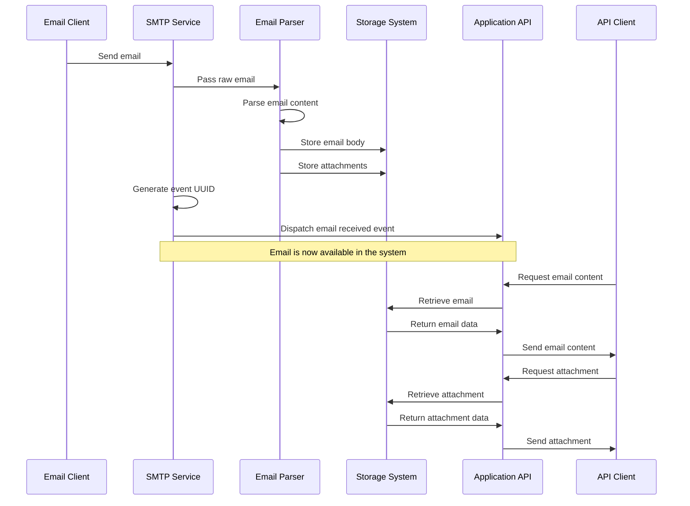

# SMTP Module

## Purpose of the Component

The SMTP module provides email handling functionality, allowing the application to receive, parse, store, and retrieve
emails with attachments. It handles the full lifecycle of email messages from SMTP protocol interaction to storage and
retrieval of email content and attachments.

## Detailed Description for Business Analyst and Marketing

The SMTP module serves as an email receiver and processor within the application, enabling automated email capture and
storage. It solves the business problem of needing to automatically process incoming emails in a structured way, making
them available through the application's API.

This component adds significant value by:

- Capturing email communications automatically without manual intervention
- Storing emails systematically for future reference and processing
- Making email content and attachments available through a standardized API
- Supporting business workflows that are triggered by or depend on email communication

The module integrates with the rest of the application to ensure emails become first-class entities within the system,
enabling email-driven processes and workflows.

## Mermaid Sequence Diagram for Business Analyst and Marketing

## List of Actors

1. **Email Sender** - Any system or person sending emails to the application's SMTP server.
2. **API Client** - Applications or services that consume the email data through the HTTP API.
3. **Event Listeners** - Internal system components that react to email-related events.
4. **Storage System** - Handles persistence of email bodies and attachments.
5. **Event System** - Distributes events related to emails throughout the application.

## List of Business Rules

### SMTP Protocol Rules

- The system must support standard SMTP commands (HELO/EHLO, MAIL FROM, RCPT TO, DATA, etc.)
- Authentication is required for sending emails (AUTH LOGIN supported)
- Multiple recipients (TO, CC, BCC) must be properly tracked

### Email Processing Rules

- All emails must be assigned a unique UUID for tracking
- Both HTML and plain text email bodies must be preserved
- Email metadata (sender, recipients, subject) must be extracted and stored
- All attachments must be properly stored with correct MIME types

### Attachment Handling Rules

- Attachments must be stored securely with access control
- Attachments must be accessible via HTTP API only by authorized clients
- Inline attachments (content-id) must be properly linked in HTML content
- Each attachment must have a unique UUID independent of its filename

### Data Retention Rules

- Email bodies are temporarily cached (1 minute) during the SMTP session
- Attachments are persisted until the associated event is deleted

## Domain Ubiquitous Terminology

- **SMTP** - Simple Mail Transfer Protocol, the standard protocol for email transmission
- **Attachment** - A file attached to an email message
- **Content-ID** - A unique identifier for inline attachments referenced in HTML email content
- **Event** - A record of an action that occurred in the system, in this case receiving an email
- **MIME Type** - The format identifier for a file (e.g., image/jpeg, application/pdf)
- **Parser** - Component that extracts structured data from raw email content
- **Repository** - A storage abstraction for accessing and managing domain objects

## Simple Use Cases

### Use Case 1: Receiving a Customer Support Email

1. A customer sends an email to support@company.com
2. The SMTP service receives the email and authenticates the session
3. The email content and any attachments are parsed and stored
4. The system generates a unique event for this email
5. The support team is notified of the new support request
6. Support staff can view the email content and download attachments via the application

### Use Case 2: Automated Document Processing

1. A business partner sends documents as email attachments
2. The SMTP module receives the email and processes it
3. Attachments are stored with appropriate metadata
4. Another system component is notified of new documents
5. The documents are automatically processed according to business rules
6. Results of processing are made available through the API

### Use Case 3: Email-Triggered Workflow

1. A specific email address receives status updates from an external system
2. The SMTP module captures these emails
3. The system parses the email subject and body for status information
4. Based on the content, specific workflow actions are triggered
5. The email and its metadata remain available for audit purposes

## Known Limitations / TODO

- The module currently doesn't support outbound email sending
- No support for email encryption (PGP, S/MIME)
- Limited email thread tracking functionality
- Potential improvement: Add full-text search for email content
- Consideration: Implement IMAP support for accessing remote mailboxes
- TODO: Enhance performance for handling large attachments
- TODO: Add spam filtering capabilities
